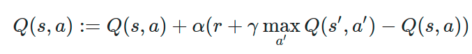
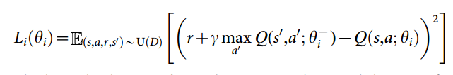
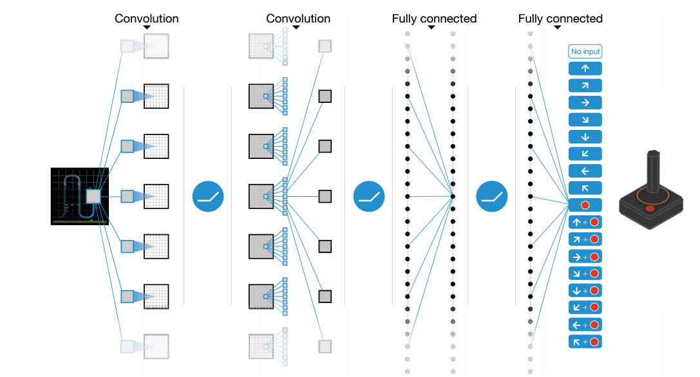

[//]: # (Image References)

[image1]: https://user-images.githubusercontent.com/10624937/42135619-d90f2f28-7d12-11e8-8823-82b970a54d7e.gif "Trained Agent"
[image2]: Q_learning.png "Q_learning"
# Project Report: Navigation in Banana unity enviroment using on Deep Q-Learning Techniques

## This report contains the following chapter:
* Introduction
* Algorithm
* Implementation
* Result
* Further Development

## Introduction

In the recent years, Reinforcement Learning (RL) is a viral topic that has been researched and developed to solved various problem in the real world. In this project, we implemented a variant of the RL algorithm called Deep Q - Learning (DQN) to solve the task of Banana Collection. 

## Task description
### Given
![Trained Agent][image1]
* A large square world with random purple and yellow bananas.
* A reward of +1 is provided for collecting a yellow banana, and a reward of -1 is provided for collecting a blue banana.
* An agent with a state space of 37 dimensions and a action space of 4 dimesntion. 
* The state space including the agent's velocity, along with ray-based perception of objects around agent's forward direction.
* Four actions for the agent to choose based on the environment:
    - **`0`** - move forward.
    - **`1`** - move backward.
    - **`2`** - turn left.
    - **`3`** - turn right.

### Goal
* Train the agent to navigate and collect as many yellow bananas as possible while avoiding blue bananas to get the highest reward. 
* The environment is considered as solved when agent get an average score of +13 over 100 consecutive episodes.

## Algorithm
To solve this problem, we implement the Deep Q - Learning algorithm mentioned in ... In that paper, they proposed a method to train an agent to play several Atari games and try to achieve highest possible scores. 

Basically, this algorithm is based on a Reinforcement learning tabular method called Q-learning. In this method, the Q value for each state-action pair is updated at each time step by the following formular:



However, the old Q-learning alogirthm used the a table to store all of the Q-value. This method is obviously not scaleable to larger state spaces, especially for the continous state. Hence, the authors in ... has approximated the Q function with a Linear neural network model and then trained this model to attain the optimal Q value. This algorithm is called "Deep Q - Learning" (DQL). This procedure can be described by the loss function as follwed:



Furthermore, to solve the problem of half observed environment and enhance the end-to-end learning feature, the authors also implemented 2 layers of Convolution Neural Network to process the spatial information gathered from the raw image of the games. The full network of the model is shown in the following image:



## Implementation

To implement the aformentioned algorithm to this project, we must do some modification which is described in this section. 

### Deep Q-Learning Model

As mentioned, the state spaces of the environment has 37 dimensions with continous values and a action space of 4 dimensions. Hence, a fully connected network with input size of 37 and output size of 4 should be used. Furthermore, in constrast to the original algorithm of ... , no convolution layer is needed because we do not consider any image as input. 

The structure of this model is implemented in `DQN_model.py`. This code is based on the Udacity Q-network implementation without major change. There are two 64 units hidden layers and each layer is activated by ReLU function. 


```python
class DQL_network(nn.Module):
    def __init__(self, state_values, action_values, seed, fc1_values = 64, fc2_values = 64):

        super(DQL_network, self).__init__()

        self.seed = torch.manual_seed(seed)
        self.fc1 = nn.Linear(state_values, fc1_values)
        self.fc2 = nn.Linear(fc1_values, fc2_values)
        self.fc3 = nn.Linear(fc2_values, action_values)

    def forward(self, state):
        x = F.relu(self.fc1(state))
        x = F.relu(self.fc2(x))
        return F.relu(self.fc3(x))
```

### DQN Learning Agent

The whole learning agent code is placed in the file `agent.py` This is also based on the Q-learning Implementation from Udacity. The agent is considered as a class called 

### Training Routine


### Hyperparameter